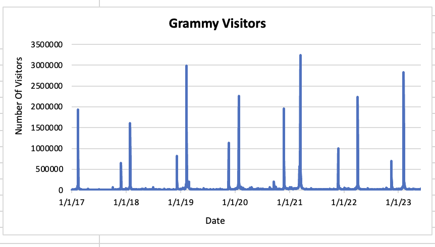
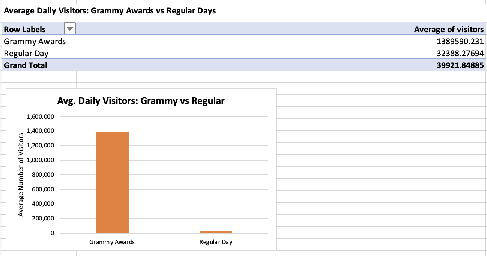
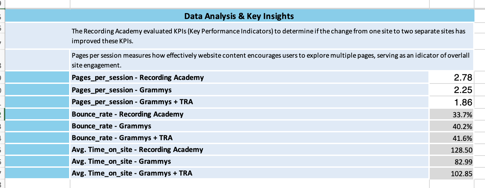
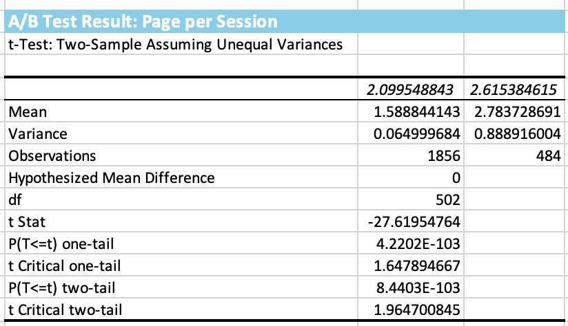

# Grammy.com Web Analytics

## Project Overview
This project analyzes website traffic and user engagement data for Grammy.com.  
The goal is to evaluate website performance, calculate business KPIs, and provide actionable insights using Excel based analysis.

---

## Objectives
- Analyze website traffic patterns
- Evaluate user engagement metrics
- Perform A/B testing
- Provide data-driven recommendations

---

## Tools Used
- Microsoft Excel
- Web Analytics
- KPI Analysis
- A/B Testing

## Analysis Screenshots

### Traffic Trends

### Daily Visitors

### KPI Summary

### A/B Test Results

